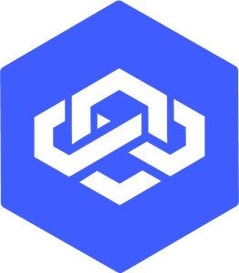
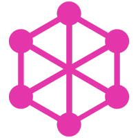

# Hi there, my name is Fran 👋
😁 Contact me here!
-   [Linkedin][linkedin]
-   [Personal website][portfolio]

## I am a 🎨Full Stack Developer🖥️ and a 👨‍🎓Business Administrator📈

-   🏂 Sports addict 🏉
-   🎶 Future bassist 🎸
-   🤖 AI enthusiast 🧠

 

## I would love to learn more about:

-   🗣️ AI Agents 🛠️
-   ⛓️ Blockchain and Cryptocurrency 💸

 

## 🛠 Tech Stack

|                 Frontend                 |                                         |                                          |                                            |                                            |
| :--------------------------------------: | :-------------------------------------: | :--------------------------------------: | :----------------------------------------: | :----------------------------------------: |
|  |   |  |    |     |
|                  HTML5                   |                  CSS3                   |                  React                   |                   Redux                    |                  Next.js                   |
|   |  |  |  |  |
|                 Vite.js                  |                  GSAP                   |                  Figma                   |                  Webflow                   |                  Hubspot                   |

|                  Backend                  |                                            |                                              |                                    |                                    |
| :---------------------------------------: | :----------------------------------------: | :------------------------------------------: | :----------------------------------------: | ------------------------------------------- |
|  |  |  |  |  |
|                  Node.js                  |                  Express                   |                  Sequelize                   |                  MongoDB                   | Loopback                                    |

|                  Full Stack                   |                                               |                                            |                                             |                                            |
| :-------------------------------------------: | :-------------------------------------------: | :----------------------------------------: | :-----------------------------------------: | :----------------------------------------: |
|  |  |  |  |  |
|                  JavaScript                   |                  TypeScript                   |                  GraphQL                   |                  Socket.io                  |                  Postman                   |

|           Tools & Platforms            |                                            |                                           |
| :------------------------------------: | :----------------------------------------: | :---------------------------------------: |
|  |  |  |
|                  Git                   |                   GitHub                   |                  VS Code                  |

## ⚙️ Git Analytics ⚡

[portfolio]: https://betodev.netlify.app/
[linkedin]: https://www.linkedin.com/in/francisco-go%C3%B1i-piuma-dev/
